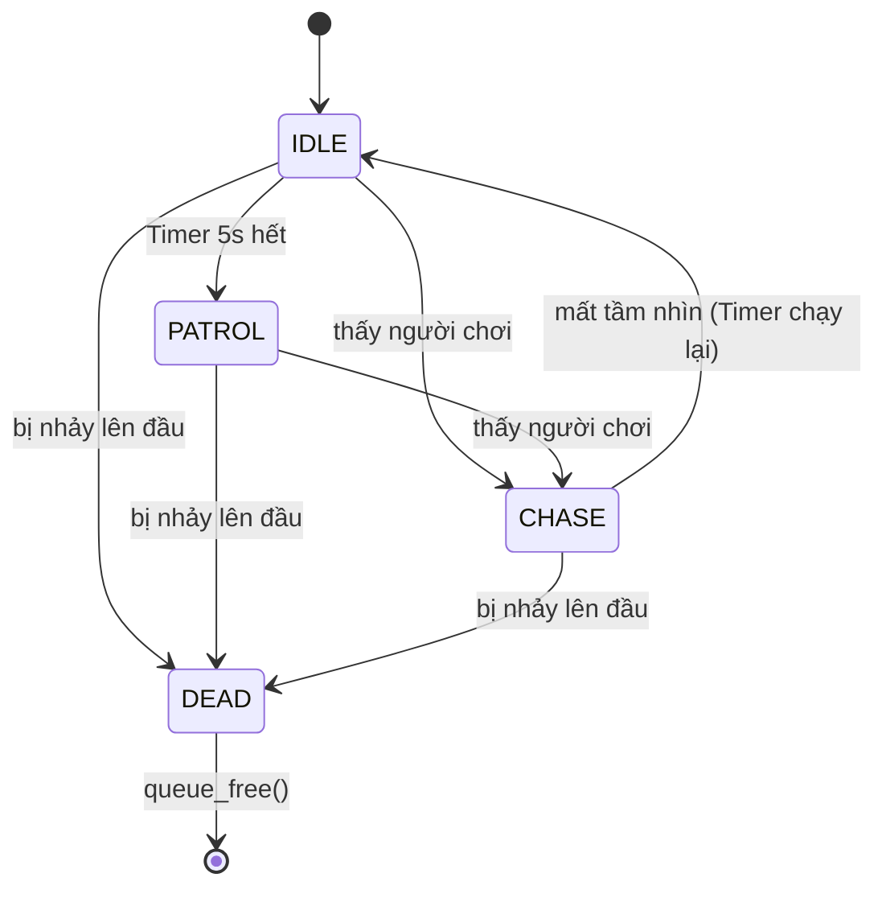
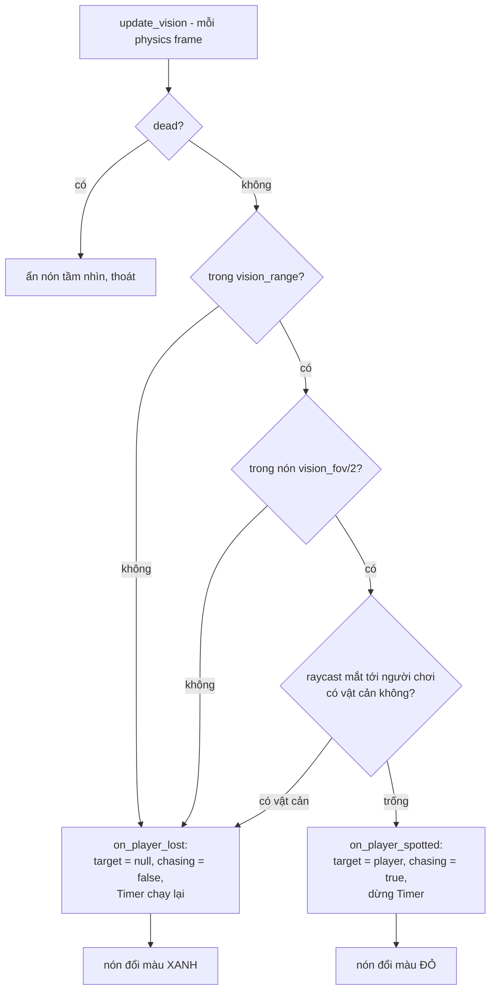
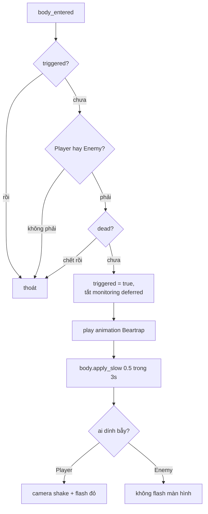

# Tổng quan dự án — Godot 4 Basic Character Controller & Enemy AI

## 1. Engine & phiên bản

| Mục | Giá trị |
|---|---|
| Engine | Godot **4.7.2-stable** (official) |
| Renderer | Forward+ (`config/features = ["4.7", "Forward Plus"]`) |
| Ngôn ngữ | GDScript |
| Main scene | `res://Main.tscn` (file trên đĩa: `main.tscn`) |
| Độ phân giải mặc định | 1280 × 720 |
| Nền tảng phát triển | Windows 11 |

Ghi chú: dự án gốc là project mẫu theo tutorial Godot 4.0 (xem `README.md`), đã được nâng lên 4.7 và mở rộng thêm gameplay (crystal, escape, trap, HUD, game over).

Addon đang bật: `addons/godot_ai` (MCP server cho AI agent) + autoload `_mcp_game_helper`. **Đây là công cụ dev, không phải gameplay** — cần tắt trước khi build phát hành.

---

## 2. Phím điều khiển

| Hành động | Phím / Chuột |
|---|---|
| Di chuyển | `W` `A` `S` `D` hoặc phím mũi tên |
| Nhảy | `Space` / `Enter` (`ui_accept`) |
| Xoay camera | Di chuyển chuột (mouse captured, sensitivity 0.5) |
| Zoom camera | Cuộn chuột lên / xuống (SpringArm3D: 4 → 15) |
| Nhảy lên đầu enemy (knockback) | `Space` khi đang đứng trên enemy |

Không có phím tấn công — người chơi chỉ né, nhảy lên đầu enemy để hạ gục.

---

## 3. Tính năng đã làm

### 3.1 Người chơi (`Player.gd`)
- Third-person controller: di chuyển theo hướng camera, xoay nhân vật bằng `slerp` theo hướng đi.
- Nhảy + trọng lực (gravity 30), khoá nghiêng trục X/Z khi đang ở trên không hoặc trên tường.
- Máu: 3 tim. Bất tử 2 giây sau mỗi lần trúng đòn (`DAMAGE_INTERVAL`), nhấp nháy model khi đang bất tử.
- Sát thương khi chạm enemy (contact damage) + knockback khi nhảy lên đầu enemy (enemy chết, tốc độ về 0).
- Debuff làm chậm (`apply_slow`) — dùng cho trap: tốc độ còn 50% trong thời gian cấu hình; slow mạnh nhất thắng, không stack.
- AnimationTree: `IDLERUN` / `JUMP` / `DEAD` với blend `Blend2`, `Blend3`.

### 3.2 Camera (`Camera.gd`)
- SpringArm3D follow người chơi, có collider chống xuyên tường.
- Zoom bằng con lăn.
- Rung camera khi trúng đòn (`shake`), tắt dần theo thời gian. Trap gọi được hàm này trực tiếp.

### 3.3 Enemy AI (`Enemy.gd`)
- State machine 4 trạng thái: `IDLE` / `PATROL` / `CHASE` / `DEAD`.
- Di chuyển bằng `NavigationAgent3D` trên navmesh (`NavigationRegion3D` trong `main.tscn`), có avoidance.
- Tuần tra: mỗi 5 giây (`Timer`) chọn một điểm ngẫu nhiên trong mặt cầu bán kính 20 quanh vị trí hiện tại.
- Truy đuổi: cập nhật đích về vị trí người chơi mỗi frame, tốc độ 10 (tuần tra 1).
- Gây sát thương khi chạm người chơi (`EnemyMesh.gd` — `_on_attack_body_entered`).
- Chết khi bị người chơi nhảy lên đầu.

### 3.4 Tầm nhìn của Enemy (mới)
- Phát hiện theo **hình nón**: `vision_range` (25 m) + `vision_fov` (**150°**, tổng góc).
- Kiểm tra thêm **line of sight** bằng raycast từ mắt enemy (`eye_height` 1.6) tới ngực người chơi; vật cản chặn tầm nhìn thì không phát hiện.
- Hiển thị trực quan: mesh nón bán trong suốt, dựng bằng code trong `_ready()` (`build_vision_cone`), màu **xanh lá khi bình thường**, **đỏ khi đang truy đuổi**.
- Cấu hình qua `@export` trong Inspector, chỉnh được cho từng enemy.
- Mất tầm nhìn thì enemy quay về IDLE rồi tuần tra lại (timer 5 giây chạy lại).

### 3.5 Bẫy gấu (`Trap.tscn` + `Trap.gd`, mới)
- 11 bẫy đặt trong `main.tscn` (`Trap`, `Trap2` … `Trap11`).
- Kích hoạt khi **người chơi hoặc enemy** bước vào vùng `Area3D`.
- Hiệu ứng khi kích hoạt:
  - Phát animation `Beartrap` của model.
  - Làm chậm 50% trong 3 giây (cả player và enemy đều có `apply_slow`).
  - Nếu là người chơi: rung camera + flash đỏ toàn màn hình (dùng lại `Camera.shake()` và `DamageOverlay.flash()`).
- **Một lần duy nhất**: sau khi kích hoạt, `monitoring` bị tắt (deferred) nên không bao giờ kích hoạt lần hai.

### 3.6 Vòng chơi
- **Crystal** (4 cái): xoay + nhấp nhô, nhặt bằng cách chạm. HUD đếm `CRYSTAL x / 4`.
- **GameManager**: đếm tổng số crystal, phát signal `progress_changed` / `all_collected`.
- **EscapeArea** + model `area_highlight_carate25`: ẩn cho tới khi nhặt đủ 4 crystal, sau đó hiện ra; chạm vào là thắng.
- **HealthHUD**, **CrystalHUD**: luôn hiển thị.
- **DamageOverlay**: flash đỏ khi mất máu (hoặc khi dính trap).
- **GameOverUI**: màn hình GAME OVER + nút PLAY AGAIN, reload `main.tscn` (reset máu, crystal, enemy).

---

## 4. Giải thích AI State Machine

Enemy dùng **state machine đơn giản** (không phải Behavior Tree), biến `state` là enum `{IDLE, PATROL, CHASE, DEAD}`.

**Bảng trạng thái**

| State | Điều kiện vào | Hành vi | Điều kiện ra |
|---|---|---|---|
| `IDLE` | Mặc định, hoặc không thấy người chơi và hết tuần tra | Đứng yên, animation idle | Timer 5 s điểm → `PATROL`; thấy người chơi → `CHASE` |
| `PATROL` | `patrolling = true` (do `Timer.timeout`) | Đi tới điểm ngẫu nhiên quanh vị trí gốc, tốc độ 1, xoay mượt về hướng đi | Thấy người chơi (`can_see_player()`) → `CHASE` |
| `CHASE` | `chasing = true` do `can_see_player()` trả về true | `NavigationAgent3D.set_target_position(player.global_position)`, tốc độ 10, xoay nhanh hơn | Mất tầm nhìn → `IDLE` + `Timer.start()` |
| `DEAD` | `dead = true` (bị người chơi nhảy lên đầu) | `dead()` → `queue_free()`, tắt collision | Không quay lại |

**Chu kỳ kiểm tra mỗi frame (`_physics_process`)**

1. `animate()` — cập nhật blend animation theo `chasing` / `patrolling` / `dead`.
2. `update_vision()` — quyết định thấy người chơi hay không, bật/tắt chase.
3. `update_slow(delta)` — đếm ngược debuff trap, khôi phục tốc độ gốc.
4. Nếu `target != null` và đang `chasing` → chạy `chasing_player()`; ngược lại nếu đang `patrolling` → đi tuần.
5. `NavigationAgent3D.velocity_computed` → `move_and_slide()`.

**Ba tầng kiểm tra tầm nhìn (`can_see_player`)** — rẻ trước, đắt sau:

1. **Khoảng cách**: `distance > vision_range` → loại.
2. **Góc**: góc giữa hướng mặt enemy (`global_transform.basis.z`, model hướng +Z) và hướng tới người chơi > `vision_fov / 2` → loại.
3. **Vật cản**: raycast mắt → ngực người chơi; trúng thứ gì không phải người chơi → loại.

---

## 5. Sơ đồ Mermaid

### 5.1 AI State Machine

### 5.2 Logic phát hiện theo tầm nhìn (thay cho Behavior Tree)

### 5.3 Luồng một bẫy gấu

---

## 6. Tài nguyên & tutorial đã dùng

**Tutorial / tài liệu**
- `README.md` của repo gốc: *Godot 4.0 Basic Character Controller and Enemy AI* — dựng khung third-person controller, camera SpringArm3D và state machine cơ bản.
- Tài liệu chính thức Godot 4: `CharacterBody3D`, `NavigationAgent3D` / `NavigationRegion3D`, `AnimationTree` (StateMachine + Blend), `Area3D`.
- MCP addon `addons/godot_ai` để điều khiển editor bằng AI agent (không thuộc gameplay).

**Model / texture (đa phần từ Sketchfab, giấy phép xem `model/*/license.txt`)**

| Tài nguyên | Đường dẫn | Dùng cho |
|---|---|---|
| Boy.glb | `GLTF/Boy.glb` | Model người chơi |
| Enemy.glb | `GLTF/Enemy.glb` | Model enemy |
| crystal_heart | `model/crystal_heart/` | 4 crystal nhặt |
| granny_bear_trap | `model/granny_bear_trap/` | 11 bẫy gấu |
| area_highlight_carate25 | `model/area_highlight_carate25/` | Vùng escape (cổng thắng) |
| Crypt / lopolyforest | `map/crypt_location`, `map/lopolyforest.mtl` | Địa hình map |
| skybox-day.png | `sky/` | Skybox |

**Scene chính**
- `main.tscn` — map, navmesh, Player, 4 Enemy, 4 Crystal, 11 Trap, camera, HUD, escape.
- `Enemy.tscn`, `Player.tscn`, `Trap.tscn`, `crystal.tscn`, `Escape.tscn`, `GameOverUI.tscn`.

---

## 7. Hạn chế hiện tại

**AI / Enemy**
- Enemy **không có trọng lực**: script chỉ set vận tốc X/Z từ navmesh, nên enemy không tự dính xuống đất (`is_on_floor()` luôn false, đứng cao hơn mặt đất ~0.5–1 m). Cần thêm gravity hoặc hạ `path_height_offset`.
- Tầm nhìn **không có trí nhớ**: vừa khuất sau vật cản là mất dấu ngay, không có "last known position" hay thời gian quên.
- Không có animation tấn công riêng; sát thương chỉ nhờ vùng `Area3D` trên model.
- Tuần tra hoàn toàn ngẫu nhiên quanh vị trí gốc, không có patrol point đặt sẵn, enemy dễ mắc kẹt ở địa hình dốc.
- Nón tầm nhìn là mesh 3D đặc, chưa có tùy chọn tắt cho bản phát hành (nên thêm `@export` bật/tắt).

**Gameplay**
- Bẫy chỉ kích hoạt **một lần**, không hồi; chưa có âm thanh.
- Không có âm thanh (SFX/nhạc) nào trong dự án.
- Chưa có hệ thống lưu game; PLAY AGAIN là reload lại scene.
- Debuff slow chỉ ảnh hưởng tốc độ chạy, không ảnh hưởng animation speed.

**Kỹ thuật / build**
- `Main.tscn` viết hoa trong `project.godot` nhưng file là `main.tscn` — chỉ chạy được nhờ Windows không phân biệt hoa thường, **sẽ lỗi khi export sang Linux**.
- Addon `godot_ai` + autoload `_mcp_game_helper` còn bật; phải loại khỏi bản phát hành.
- Navmesh phải bake từ `main.tscn` (không bake từ `Map.tscn`), và Recast làm tròn `agent_radius` theo `cell_size`.
- Rất nhiều cảnh báo "old surface format" khi import model cũ trong `Boy.tscn` / `EnemyMesh.tscn`.
- Chưa có nút pause / menu cài đặt, chưa có tùy chọn độ nhạy chuột trong game.
